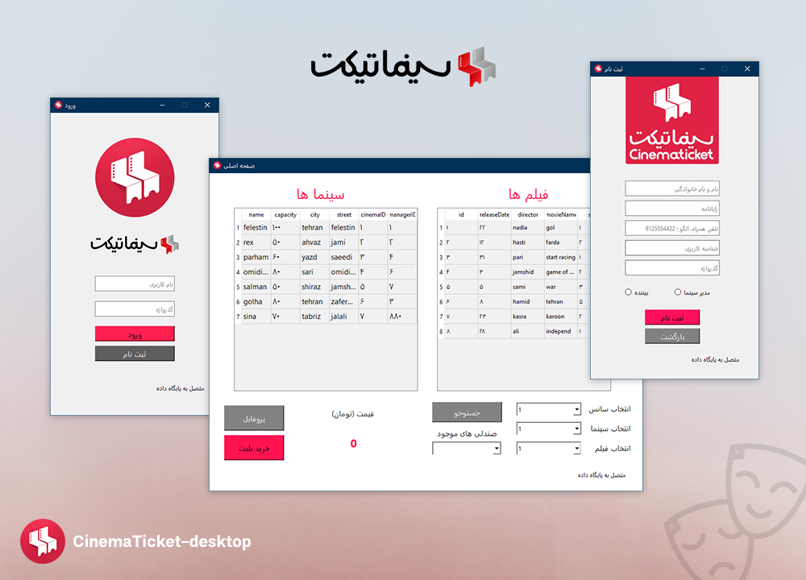

# cinematicket-desktop

  
  
 Cinema Ticket desktop

  
A desktop application for the <a href="https://cinematicket.org/">cinematicket</a> website

## Description
This app is not connected to the Cinema Ticket website database and has a local database. You can register and log in, see cinemas and movies, find empty seats for movies in cinemas and buy tickets according to the price.

## Requirements
- [Qt](https://www.qt.io/) (version 4 or higher is recommended)
- [Sqlite 3](https://www.sqlite.org/index.html) (you can use [SQLiteStudio](https://sqlitestudio.pl/) to work with database)

## Platforms
this app is a Qt widget application. One framework. One codebase. Any platform.

## About
Database course final project at [Bu-Ali Sina university of Hamedan](https://basu.ac.ir)

A graphical user interface program had to be built that, by connecting to a local database, could perform simple operations for watching movies and cinemas and buying tickets.
## Contributors
[Elnaz Sharafian](https://github.com/el-sharafian), 
[Mahshid Oveisi](https://github.com/mahshid-o) ,
[Mohammad Moradi](https://github.com/itismoradi)

## License
With [GPLv3](https://www.gnu.org/licenses/gpl-3.0.en.html) license option, we have access to almost all Qt framework functionality, as well as development and design tooling
